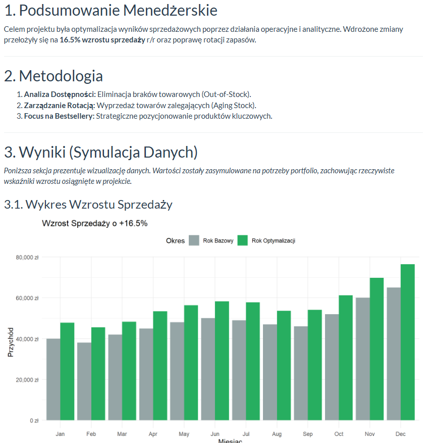

#  Business Case: Optymalizacja Sprzedaży (R Markdown)

### [Pobierz pełny raport HTML](Case_Study_Optymalizacja_Sprzedaży.html)

Analiza wpływu działań optymalizacyjnych na wyniki sprzedażowe w sektorze retail.
Projekt łączy podejście biznesowe (KPI, rotacja zapasów) z analizą danych w R.

###  Użyte Technologie:
*   **R (R Markdown)** - generowanie raportu.
*   **ggplot2** - wizualizacja danych.
*   **dplyr** - manipulacja danymi.

###  O projekcie:
Raport przedstawia symulację wyników na podstawie rzeczywistego case study.
Główne osiągnięcia:
*    Wzrost sprzedaży: **+16.5%**
*    Poprawa rotacji zapasów: **76.8 dnia**
